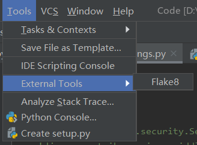

## 软件后端测试
### 1.静态代码分析
**工具：**  pycharm里面插件 *flake8*(默认安装好python和pycharm) 
**安装:**  系统(Windows10)命令行中输入
~~~java
pip install flake8
~~~
**配置：** Pycharm->Perferences->Tools->External Tools，点击“+”，填写配置 
**实现：**如图，导入代码之后，点击flake8,跑一遍就可以分析

**静态代码分析**如下：
可以看出代码主要是一些包，变量没有使用，空格问题。没必要去改，必然遇到不必要的麻烦。

### 2.接口测试
**工具：**  软件postman(下载安装即可)
**实现：**  运行后端之后，输入对应api接口链接(参照项目api文档)，进行post、get、put操作，body中以json格式输入对应参数。response得到反馈结果。见图：

实例：用户注册接口测试：

根据接口文档，分别进行测试，小组内多次测试，制成测试表格，如下：
