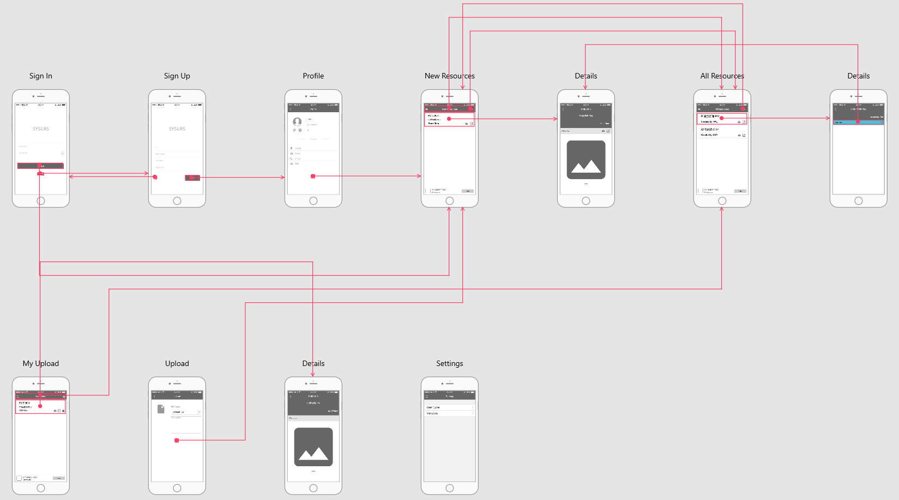
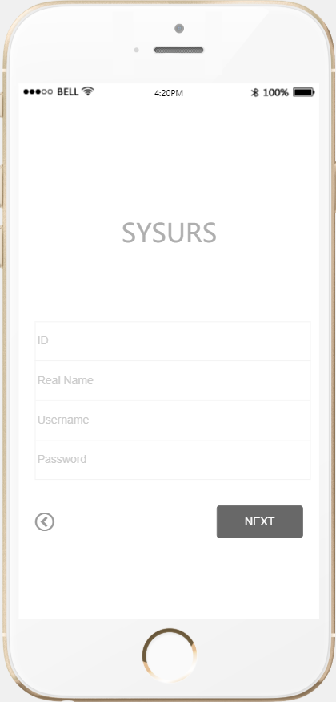
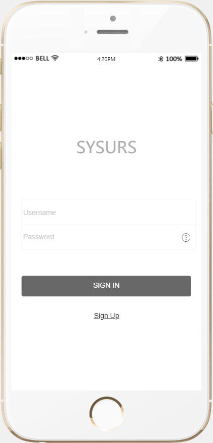
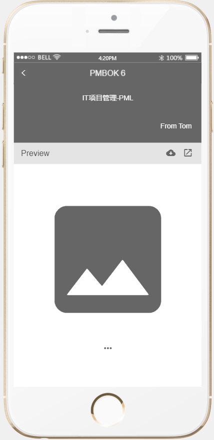
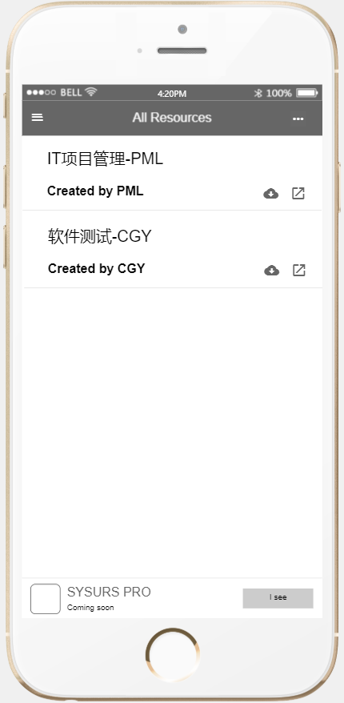
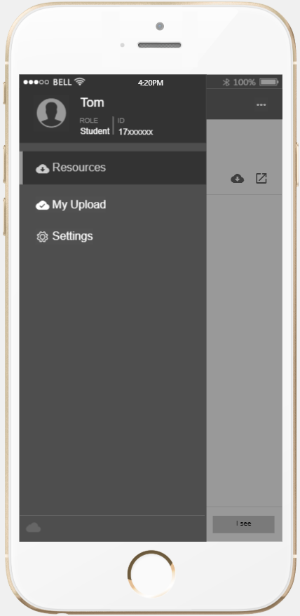
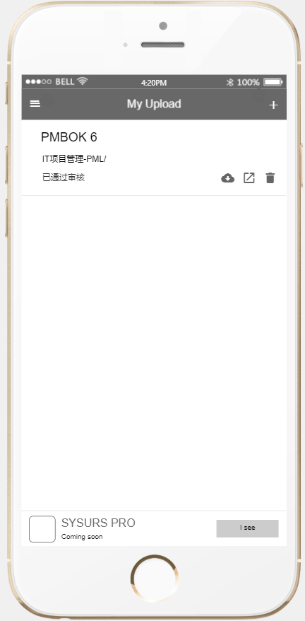
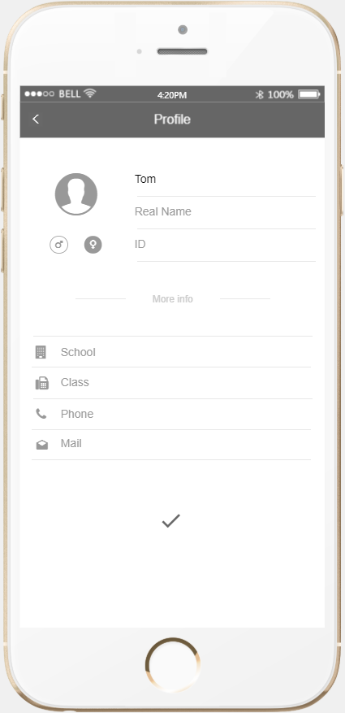
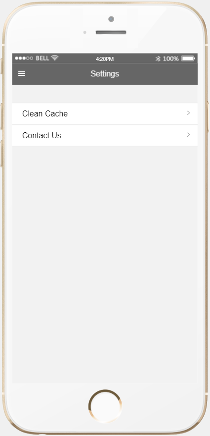

# 学校资源共享软件项目需求说明书

## 一、简介

本文档为学校资源共享项目SYSURS(SYSU Resources Share)的产品需求文档，主要作为确认需求以及系统分析设计的依据。

## 二、用户角色描述

|用户角色|用户描述|
|:--:|:--:|
|老师|可以自行创建目录并上传资源（无需审核）|
|学生|可以自行创建目录并上传资源（需要经过一定的后台审核）|

<!-- |平台管理员|用于审核注册成员身份，审核资源| -->

## 三、产品概述

### 3.1 目标

该（精简）项目主要为了解决校内学习资源共享存在的种种问题，这些问题出现于现在常用的资源共享工具（QQ/微信、公邮、FTP等）中，希望能够实现满足绝大多数同学学习资源分享/获取的的需求。

### 3.2 功能摘要

|功能模块|主要功能点|功能描述|
|:--:|:--:|:--:|
|登录/注册|管理员审核|后台给定管理员账号，管理员输入用户名、密码可以直接登录|
||老师/学生注册|提供工号/学号、真实名字，并设置用户名和密码|
||老师/学生登录|使用工号/学号以及密码进行登录|
|老师/学生界面|现有（课程）资源列表|任何用户都可以查看现有资源|
||自上传资源界面|显示当前用户上传资源列表（对于学生上传资源显示审核状态），并提供上传资源接口和删除接口|

<!-- |管理员界面|用户身份审核界面|审核学生和老师的工号/学号及姓名信息| -->
<!-- ||资源审核|上传资源审核界面|审核学生的上传资源| -->

### 3.3 软件原型

下图是不同页面之间的跳转关系概况，具体的页面解释见功能说明。

## 四、功能说明

### 4.1 第一部分 登录/注册

#### 4.1.1 功能描述

老师/学生都可登录系统，登录后进入主界面。

#### 4.1.2 功能说明

##### 功能点1：老师/学生注册

- 用户场景：
    用户点击注册按钮，选择身份，填写信息进行注册
- 需求描述：
    提供工号/学号、真实姓名以及账号和登录密码进行注册
- 原型界面：

  

##### 功能点2：老师/学生登录

- 用户场景：
    用户点击登录按钮
- 需求描述：
    用户输入注册时使用的用户名和密码即可登录
- 原型界面：

   

### 4.2 第二部分 资源上传/获取

#### 4.2.1 功能描述

老师/学生进行资源的上传共享和获取。

#### 4.2.2 功能说明

##### 功能点1：资源获取

- 用户场景：
    用户登入主界面查看已审核资源。
- 需求描述：
    用户在登录后主界面即可看到所有已上传已审核的资源，并且只有经过身份审核验证的用户可以下载。
- 原型界面：

    

    如界面所示，用户在登录后主界面展示的是最近上传的资源，会显示资源名及所属的文件夹（课程）以及上传者的用户名。点击该项后可以如下显示资源的预览，该页面可以下载、分享已上传资源——

    

    倘若在主界面点击右上角的省略号，可以显示目前所有已创建文件夹（课程）——

    

    点击其中一个文件夹后可见该文件夹下的资源——

    

    点击列表中的某一项后同样可以显示资源详情和预览。

##### 功能点2：资源上传

- 用户场景：
    用户在资源管理界面（管理自己上传资源）进行资源上传。
- 需求描述：
    只有经过身份审核的用户才可进行资源上传，且学生用户上传的资源需要经过审核。
- 原型界面：

    在主界面点击左上角菜单键可出现弹出式菜单——

    

    在这里选择My Upload即可显示当前用户上传的资源以及上传资源的相关信息及审核状态，在该页面可以下载、分享、删除已上传资源——

    

    点击具体资源项同样可展示预览——

    

    点击My Upload界面右上角的+号即可跳转到资源上传界面——

    

    点击文件图标可从本地选择文件上传，需要输入文件名、所属课程（可进行创建）、以及资源描述。

### 4.3 第三部分 其他功能

#### 4.3.1 功能描述

包括用户信息设置界面以及系统设置界面。

#### 4.3.2 功能说明

##### 功能点1：用户信息设置

- 用户场景：
    用户填写个人信息。
- 需求描述：
    用户对个人信息进行填写，方便审核信息及其它信息的通知。
- 原型界面：

    

##### 功能点2：系统设置

- 用户场景：
    提供关于软件的其它服务。
- 需求描述：
    暂时仅提供清理软件缓存及反馈机制服务。
- 原型界面：

    
