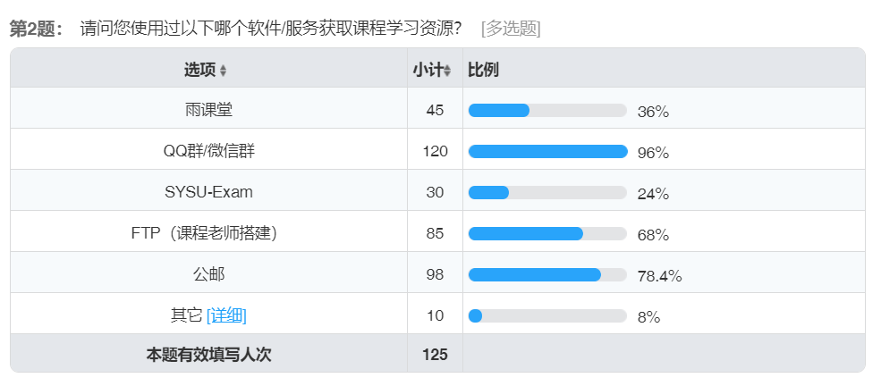
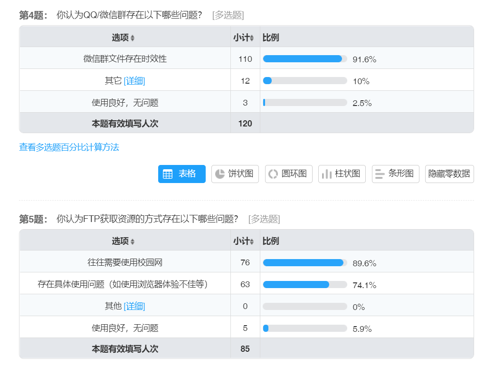
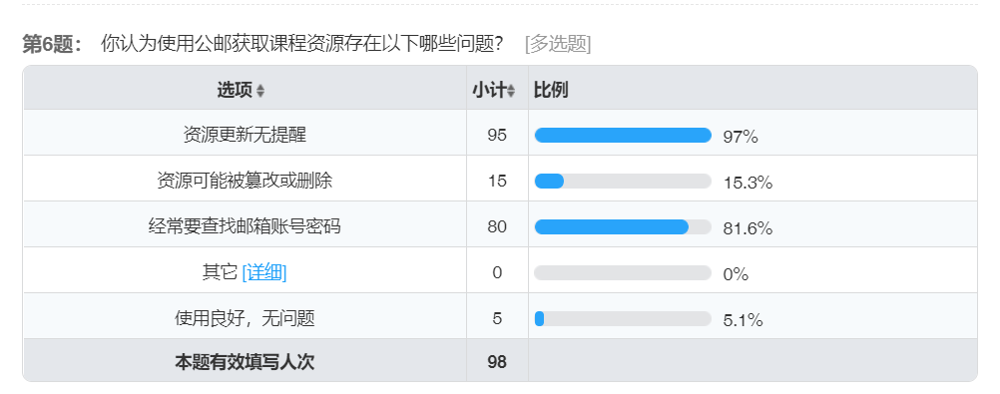
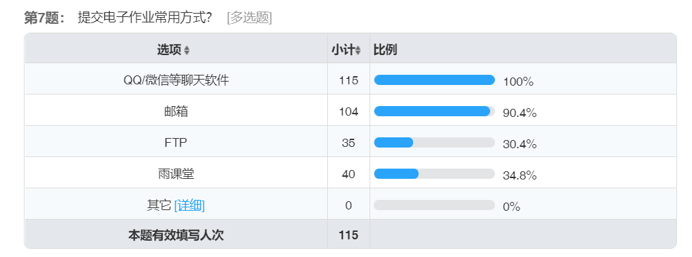
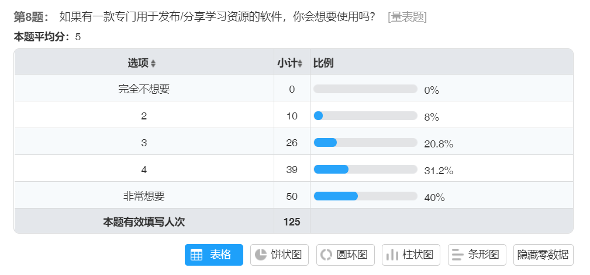
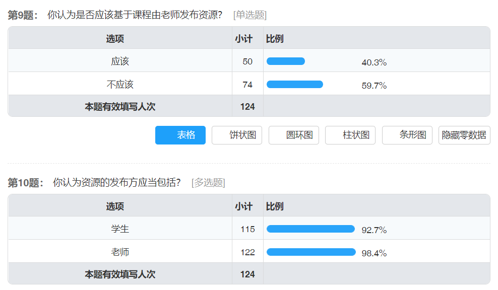
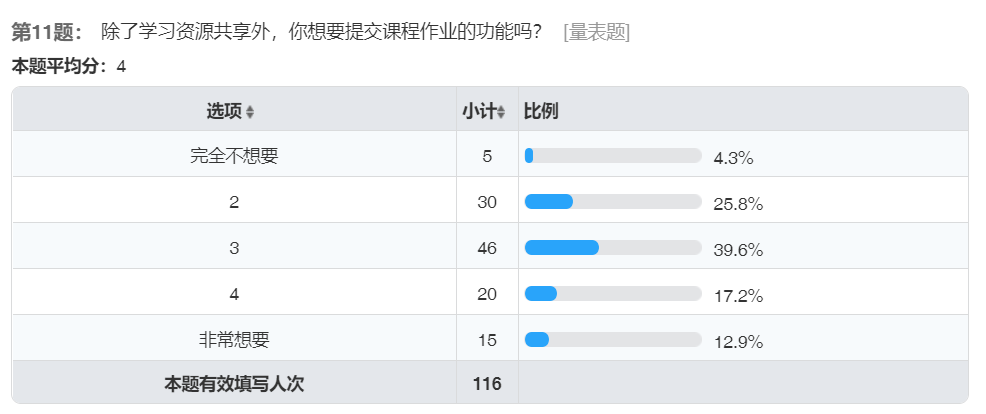
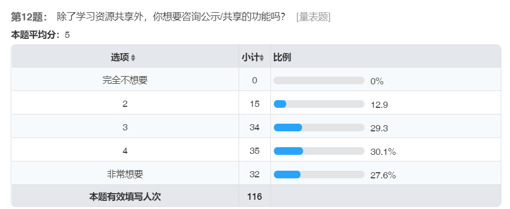
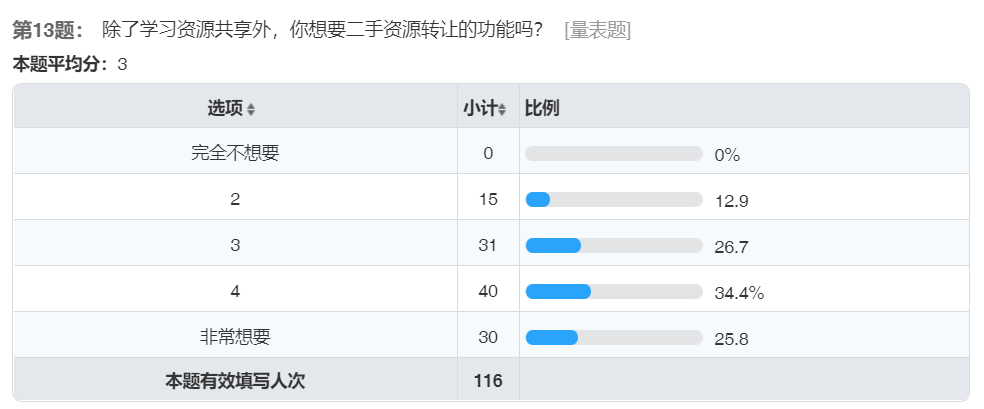
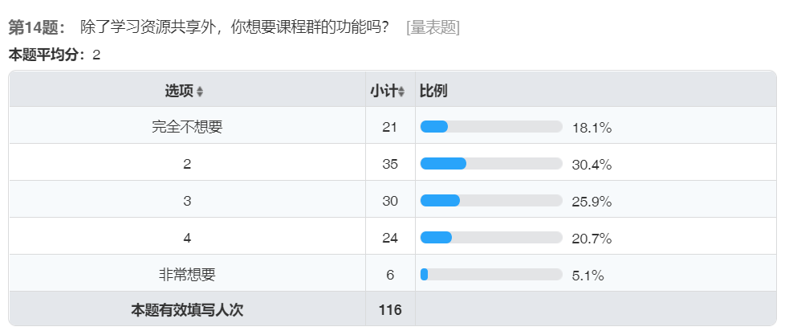

# 需求问卷调查

## 问卷具体内容

**以下是发布在问卷星上的需求调查问卷具体内容**

```
1. 请问您是否是中山大学的学生？ [单选题] *
○是
○否

2. 请问您使用过以下哪个软件/服务获取课程学习资源？ [多选题] *
□雨课堂
□QQ群/微信群
□SYSU-Exam
□FTP（课程老师搭建）
□公邮
□其它 _________________

3. 你认为使用雨课堂的过程中存在什么问题？ [填空题]

_________________________________

4. 你认为QQ/微信群存在以下哪些问题？ [多选题] *
□微信群文件存在时效性
□其它 _________________
□使用良好，无问题

5. 你认为FTP获取资源的方式存在以下哪些问题？ [多选题] *
□往往需要使用校园网
□存在具体使用问题（如使用浏览器体验不佳等）
□其他 _________________
□使用良好，无问题

6. 你认为使用公邮获取课程资源存在以下哪些问题？ [多选题] *
□资源更新无提醒
□资源可能被篡改或删除
□经常要查找邮箱账号密码
□其它 _________________
□使用良好，无问题

7. 提交电子作业常用方式？ [多选题] *
□QQ/微信等聊天软件
□邮箱
□FTP
□雨课堂
□其它 _________________

8. 如果有一款专门用于发布/分享学习资源的软件，你会想要使用吗？ [单选题] *
○完全不想要 ○2 ○3 ○4 ○非常想要

以下都是对于该学习资源共享软件的问题

9. 你认为是否应该基于课程由老师发布资源？ [单选题] *
○应该
○不应该

10. 你认为资源的发布方应当包括？ [多选题] *
□学生
□老师

11. 除了学习资源共享外，你想要提交课程作业的功能吗？ [单选题] *
○完全不想要 ○2 ○3 ○4 ○非常想要

12. 除了学习资源共享外，你想要资讯公示/共享的功能吗？ [单选题] *
○完全不想要 ○2 ○3 ○4 ○非常想要

13. 除了学习资源共享外，你想要二手资源转让的功能吗？ [单选题] *
○完全不想要 ○2 ○3 ○4 ○非常想要

14. 除了学习资源共享外，你想要课程群的功能吗？ [单选题] *
○完全不想要 ○2 ○3 ○4 ○非常想要

```

## 问卷调查结果分析

本次调查共收集了125份问卷，其中大部分调查对象均来自中大：


### 具体题目分析



由上面的调查结果来看可以发现大部分同学都是通过QQ/微信、公邮、FTP来获取课程学习资料的，还有一些同学使用过用雨课堂、SYSU-Exam（可能和填写问卷的同学大部分是数据院的有关）以及其它软件和服务。

---

下面几题是关于第二题中提到的几种资源共享软件/服务的不足之处进行的调查，绝大部分受访者认为这些软件/服务都存在一定的缺陷，比如微信群文件的时效性是最受诟病的一大问题，还有课程老师搭建的FTP服务器往往需要校园网（对目前这种离校的情况特别麻烦，需要挂VPN，甚至在21号端口被禁时挂上VPN还是无法访问），公邮的资源更新没有提示的问题同样也是一大问题（毕竟不像个人邮箱那样会时常去查看）。




<!-- ---

 -->

---

下题可见绝大部分同学都希望能够有一款专门用于发布/分享学习资源的软件,对于这题71%以上的用户选择了4分以上，因此我们前期的工作重点应该在于发布/分享学习资源，类似于一个区分课程的共享网盘。



---

下面两题是对项目前期主要功能的主要影响因素，图图可见大多数同学认为资源应当由老师和学生共同进行发布，并且课程目录不一定由老师进行创建，这一点与我们的预期基本一致。


---

下面四项是希望在项目后期添加的其它功能，原先预期按调查结果先实现其中呼声最高的一个，现在看来就是资讯的公示/共享，但由于时间紧张以及组员时间安排的问题，可能需要暂时搁置这一需求。








---

结合上述结果并经过讨论，组内决定项目的前期目标是建立一个学生及老师均可创建课程目录（根据用户标识进行区分）并且参与共享/发放学习资料的平台，在后期再逐步添加其它功能。
