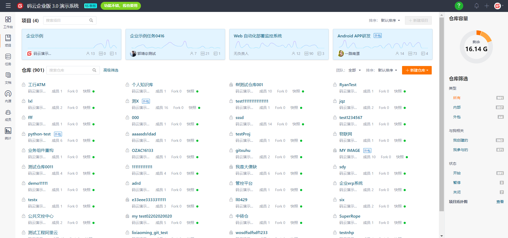
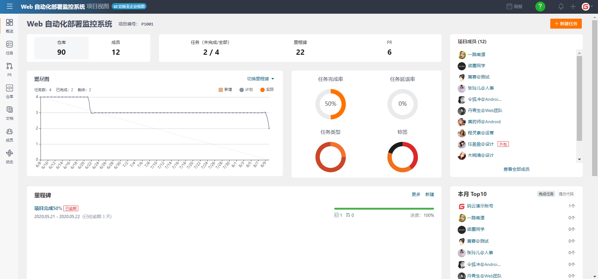
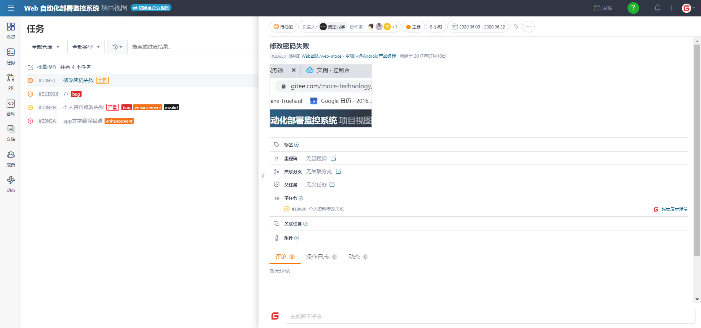
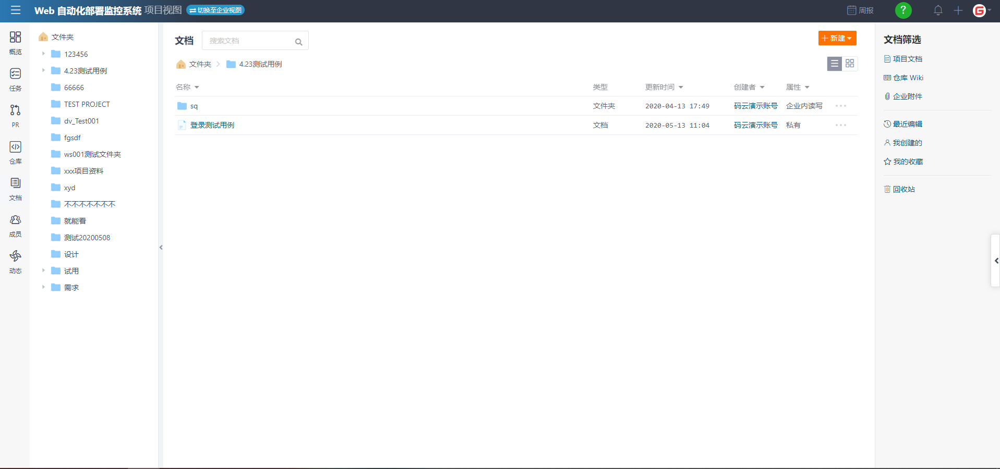
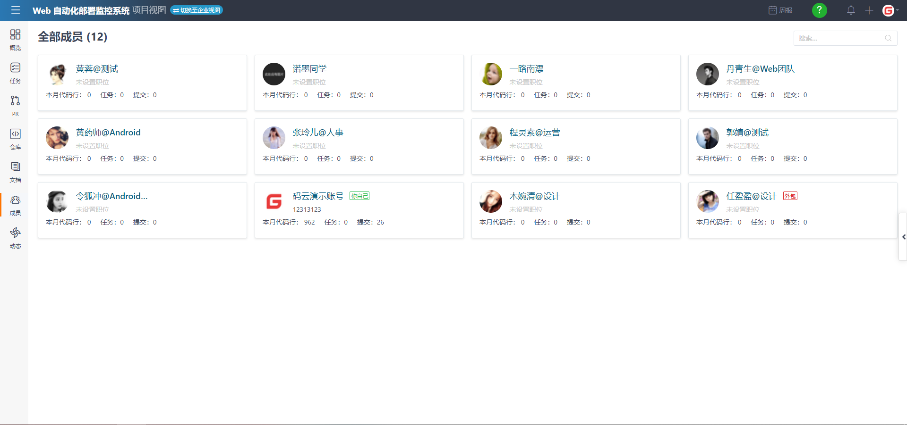
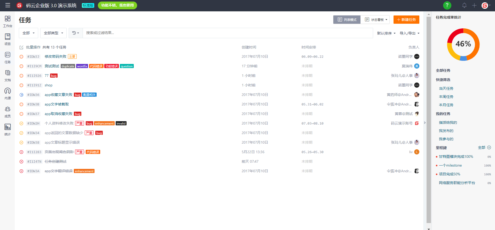
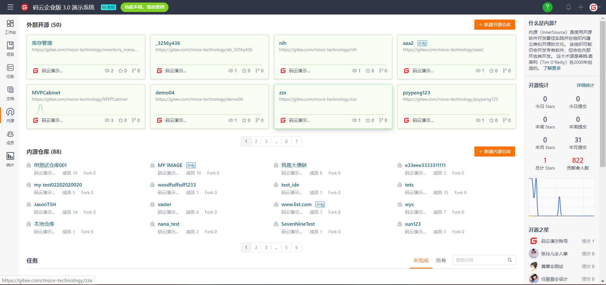
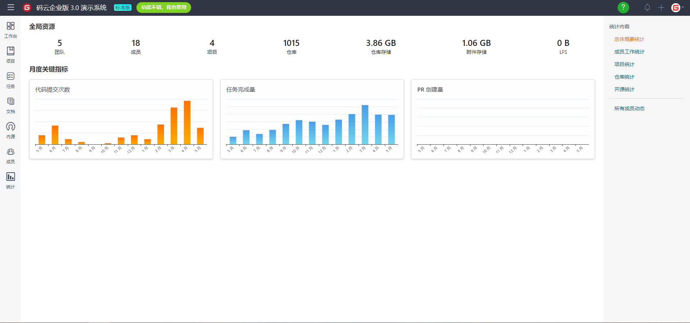
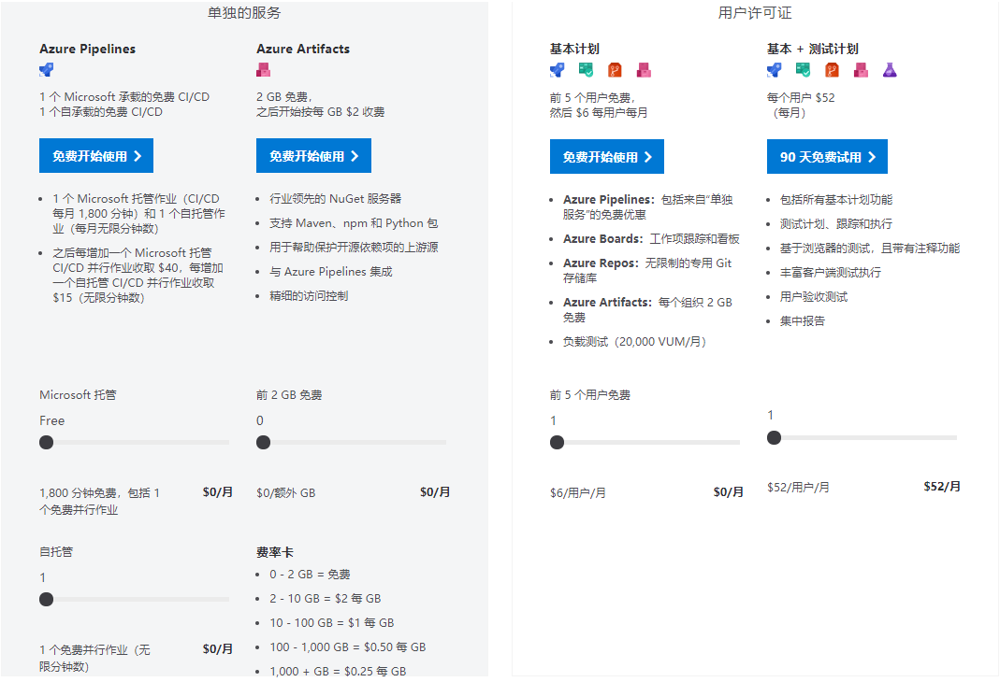
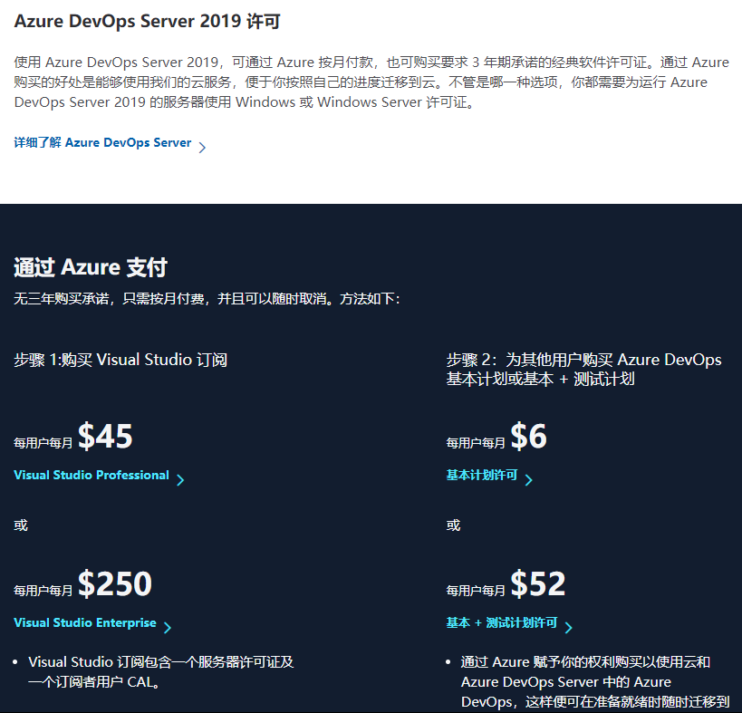

# 云或移动项目管理服务软件——Business Case文档

## 前言
  
这是中山大学数据科学与计算机学院软件工程专业IT项目管理的第二次团队作业博客部分，由“全都实习没人干活组”博客小队完成。  
## 成员贡献  

 

## 竞争产品分析

## 项目使用说明
### 功能介绍
对于云或移动项目管理服务软件,这里使用"码云"来作为功能演示的范例，首先作为一个云或移动项目管理服务软件，需要做到的是，对于团队来进行协作开发，包括但不限于代码共享，代码托管，任务发布与监控，权限管理等等。

### 主页面（工作台）

可以看到，主页面包括了参与项目，参与任务，项目完成情况，代码量，任务完成情况等信息，左侧一栏是各种具体功能，接下来我会一一介绍。

### 项目

这一项是可以总体的看到我们负责的所有项目，包括参与的所有仓库，以及在右侧可以看到各种详细的项目信息。

点进项目之后，我们可以查看到关于具体项目的详细信息，包括项目成员，项目任务，任务完成情况，燃尽图等等信息，具体功能有包括pull Request,发布任务，建立仓库管理仓库等等。

其中最主要的就是可以查看任务的详细信息以及完成情况。这里的信息还包括任务类型，出现错误发布任务的仓库，任务负责人，任务讨论等等。

在文档内可以查看到根据文件夹分类的各种关于项目的说明文档，还可以根据条件筛选出要找的文档。

在成员这一项中可以看到各个成员本月的代码量以及任务完成情况，点击成员头像之后，还能以表格的形式查看到成员的详细信息。

### 任务

这里的任务和项目内部的任务其实没什么不同，可以总体的查看关于所有项目的完成情况和统计数据。

### 内源

这里根据各种仓库的查看与修改权限，对各个仓库的资源进行了限制，根据当前账户的权限，给出开源的仓库以及内部的仓库。

### 统计

这项功能是通过图表的形式，清晰的展示了关于各个项目任务的各种指标，以此来评估成员对项目的贡献。

## 盈利模式分析

### 对Azure DevOps营销策略的分析

Azure DevOps(TFS)是微软旗下的团队软件开发管理产品，能够为敏捷开发提供良好的支撑。作为微软庞大的软件体系下的一员，尽管它采用的营销方式和大部分竞品较为相似，但在某些方面还是带有些许微软的风格。

Azure DevOps提供了云端版本（Azure DevOps Services）和本地版本（Azure DevOps Server），两种版本采取了不同的收费策略，根据用户选择的服务再进一步采取不同的收费策略。

#### 云版本

Azure DevOps依托微软自身强大的云服务资源作为支撑，能够在较大程度上降低它提供相关服务的成本，因此能够在价格拉锯战中具有先天优势，尤其是为小型的（敏捷开发）团队提供了近乎长期免费的服务（与Jira相似，对小型开发团队近乎免费），这一点是大部分提供软件开发管理服务的软件难以承担的。对于小团队的拉拢一方面不会造成太大的成本损耗，另一方面在一定程度上帮助其占据更大的市场份额，这笔钱相当于廉价的、性价比超高的宣传成本，并且能够帮助创造一个良好的社区环境，即使这笔钱再多一些凭借微软的体量也绝对烧得起。因此Azure DevOps的主要盈利来源主要还是中到大型团队或企业用户。

#### 本地版本

对于本地版本总体上采用的也是传统的先试用后收费的方式，相较于常见的15~30天的试用期，Azure DevOps Server提供了90天的试用期，让团队用户对其产生更强的依赖性；过了试用期后可以选择**购买3年期承诺的软件许可**，也可以选择以**月付**的方式进行付费，并且可随时取消，一紧一松的收费模式能够满足不同组织形式的团队进行选择，前者更加适用于企业用户或长期的合作团队，而后者对于有本地部署需求的敏捷开发自组织团队似乎更加友好。
具体的收费模式——

- 服务器端需要订阅Visual Studio专业版或企业版以获取服务器许可证从而进行部署
- 客户端用户需要订阅云版本中提及的基本计划，收费标准与其一致

值得注意的是本地部署要求操作系统为Windows Server，操作系统与软件的捆绑是微软的一贯套路，可以体现微软对其旗下产品的自信，不论是对操作系统还是对软件。

### 对我们产品盈利方式的启发

考虑到微软采用的营销策略是建立在它强大的云服务资源之上的，并且它不仅提供了较为完整的敏捷开发支撑，还提供了配套的软件测试工具（尽管需要另外收费），因此作为一个新生产品我们的定位要更加精细化，比如说，单就敏捷开发而言Azure DevOps相较于Jira还是存在不足，也就是说我们在这方面可以加以改进；另一方面，在试用期的长度问题上，在保证产品能够产生足够用户粘性的条件下，试用期在运营成本的控制下越长越好；还有一点就是在提供云服务这个问题上，最好能够为用户争取到性价比更高的云部署平台。