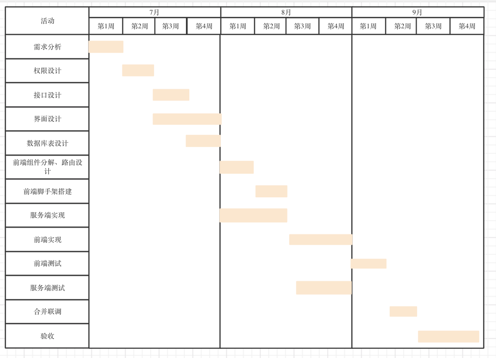

### 中山大学学习资源分享平台项目管理计划

 

#### 概述
---
**最终产品**：中山大学学习资源分享平台网站（以下简称“平台”）  
**项目目的**：平台旨在为中大学生提供一个统一、便利的学习资源共享平台，建设中大全体师生的共享网盘，为教学、学习提供便利。  
**可交付成果**：完成平台各部分的上线部署及测试，并正式投入运营。  
**项目时间**：2020年7月-2020年9月  
**项目预算**：2000元（服务器费用）  

 

#### 项目组织
---
|姓名|角色|职位|联系方式|
|-|-|-|-|
||发起人、需求分析、进度监督、里程碑审核、系统权限设计|项目经理|&emsp;|
||接口设计人、服务端技术方案选定、数据库表设计、服务端里程碑审核、服务端测试、服务端代码审核|服务端负责人|&emsp;|
||服务端代码实现|服务端组员|&emsp;|
||UI/UX 设计、前端里程碑审核|设计师|&emsp;|
||接口设计、前端技术方案选定、页面组件分解、前端路由设计、脚手架搭建、前端测试、前端代码审核|前端负责人|&emsp;|
||前端代码实现|前端组员|&emsp;|

 

#### 控制过程计划
---

